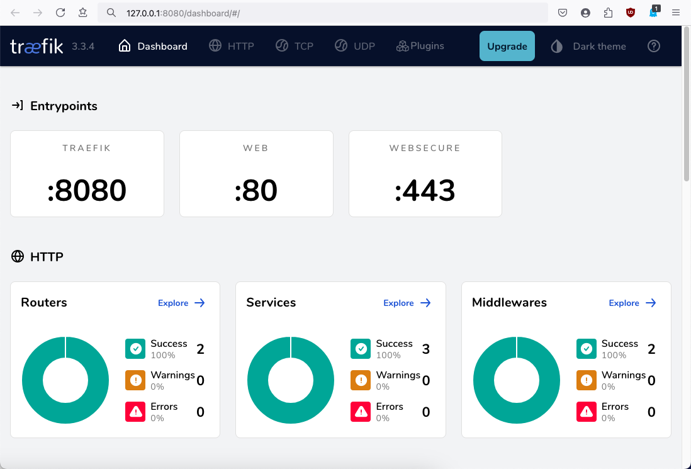
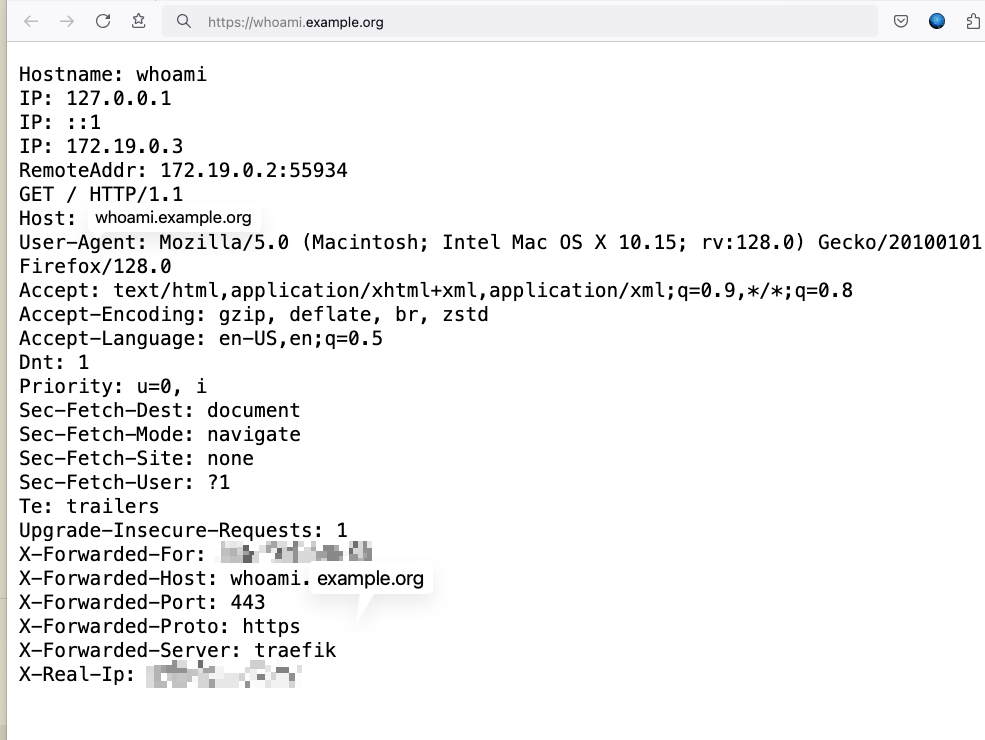
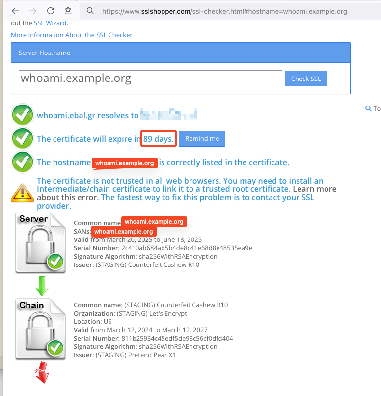
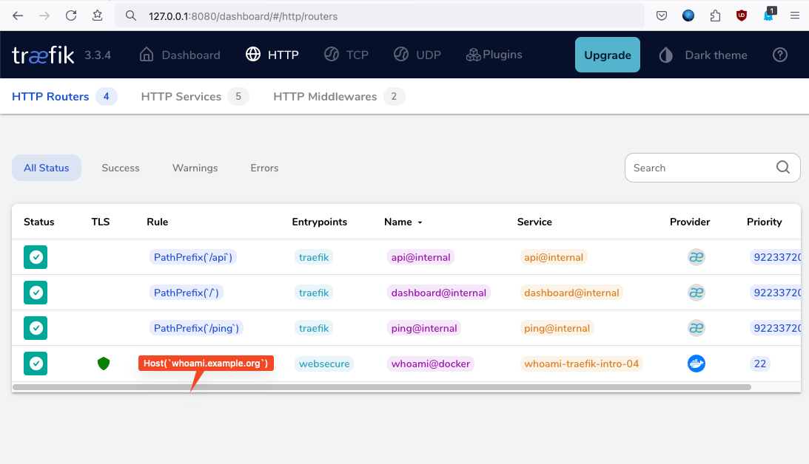

# Setting Up Traefik Reverse Proxy with Let's Encrypt

a blog post series about my homelab.


## Part Four

Traefik is a powerful reverse proxy that simplifies the process of handling multiple web applications with automated SSL certificate management using Let's Encrypt. In this blog post, I'll document my journey of setting up Traefik as a reverse proxy using Docker Compose, along with automatic SSL certificate generation.

To streamline this blog post, I'll exclude the dynamic file provider from the previous post and provide two versions of the Docker Compose file:
* One using the default Docker bridge network with exposed ports.
* Another using the host network mode.
I will present below the differences.

check here for [Introduction to Traefik - Part Three](https://github.com/ebal/traefik-intro-03)

## Prerequisites

Before starting, ensure you have:

- A Linux-based system with Docker and Docker Compose installed.
- A registered domain (e.g., `example.org`).
- DNS records pointing to your server (e.g., `whoami.example.org`).

## Step 1: Writing the Docker Compose File

We'll start by defining a `docker-compose.yml` file that sets up Traefik and a test service (`whoami`).

```yaml
---
services:
  traefik:
    image: traefik:v3.3
    container_name: traefik
    hostname: traefik
    env_file:
      - ./default.env # Simplified path
    restart: unless-stopped
    ports:
      # The Web UI (enabled by --api.insecure=true)
      - 8080:8080
      # The HTTP port
      - 80:80
      # The HTTPS port
      - 443:443
    volumes:
        # The directory where the ACME certificates are saved.
      - ./certs:/certs
        # Traefik configuration directory
      - ./traefik:/etc/traefik
        # Docker socket for Traefik, to listen to docker containers.
      - /var/run/docker.sock:/var/run/docker.sock:ro
    # Add health check
    healthcheck:
      test: ["CMD", "traefik", "healthcheck"]
      interval: 30s
      retries: 3
      timeout: 10s
      start_period: 10s

  # A container that exposes an API to show its IP address
  whoami:
    image: traefik/whoami
    container_name: whoami
    hostname: whoami
    depends_on:
      traefik:
        condition: service_healthy # Wait for Traefik to be healthy
    labels:
          # Enable routing for whoami service in Traefik
        - traefik.enable=true
          # The host rule for the whoami service
        - traefik.http.routers.whoami.rule=Host(`whoami.example.org`)
          # Listen Only to WebSecure EntryPoint (only on 443)
        - traefik.http.routers.whoami.entryPoints=websecure
          # Let's Encrypt as TLS certificate resolver
        - traefik.http.routers.whoami.tls.certResolver=letsencrypt

```

### Explanation

* **Traefik Service**:
  * Uses the official Traefik image.
  * Exposes ports 80 and 8080 (for the dashboard).
  * Exposes TCP port 443 (for the TLS certificate).
  * Mounts volumes for certificates and configurations.
  * Uses a health check to ensure Traefik is running.

* **Whoami Service**:
  * A simple container to test the reverse proxy.
  * Uses Traefik labels for automatic routing and SSL setup.

### differentes between the two docker compose files

```yaml
-     ports:
-       # The Web UI (enabled by --api.insecure=true)
-       - 8080:8080
-       # The HTTP port
-       - 80:80
-       # The HTTPS port
-       - 443:443

+     # Very important in order to access the VM
+     network_mode: host

```

## Step 2: Configuring Traefik

The `traefik/traefik.yml` configuration file defines how Traefik behaves.

```yaml
# The /ping health-check URL
ping: {}

# API and dashboard configuration
api:
    dashboard: true
    insecure: true

# Debug log
log:
    filePath: /etc/traefik/traefik.log
    level: DEBUG

# Enable EntryPoints
entryPoints:

    web:
        address: ":80"
        reusePort: true

    websecure:
        address: ":443"
        reusePort: true

certificatesResolvers:
    letsencrypt:
        acme:
            # caServer: https://acme-v02.api.letsencrypt.org/directory # Default
            caServer: https://acme-staging-v02.api.letsencrypt.org/directory
            email: acme-staging@disposable.space
            # Local Directory to store TLS certificates
            storage: /certs/acme.json
            # When using the TLS-ALPN-01 challenge, Traefik must be reachable by Let's Encrypt through port 443.
            tlsChallenge: {}

# Providers
providers:
    # Enable docker provider
    docker:
        exposedByDefault: false

    # Enable file provider
    file:
        directory: /etc/traefik/dynamic/
        watch: true

```

### Explanation

- **API & Dashboard**: Enables the Traefik dashboard (accessible at `http://127.0.0.1:8080)`.

- **EntryPoints**: Defines ports for HTTP (80) and HTTPS (443).

- **Let's Encrypt Setup**:

  - Uses the staging ACME server for testing.

  - Stores certificates in `/certs/acme.json`.

  - Uses TLS challenge for verification.

- **Providers**:

  - Enables Docker provider (auto-detects containers with labels).

  - Loads additional configuration from files.

## Step 3: Running the Setup

Run the following command to start the services:

```bash
docker-compose up -d
```

To verify that Traefik is working, open the dashboard:

http://127.0.0.1:8080



### Testing

For testing, visit `https://whoami.example.org` (ensure **DNS** is set correctly).



### Verify TLS certificate



### Traefik TLS Dashboard



## Step 4: Moving to Production

Once everything works, switch Let's Encrypt to production mode by modifying:

```yaml
caServer: https://acme-v02.api.letsencrypt.org/directory
```

Restart Traefik to apply changes:

```bash
docker-compose down && docker-compose up -d
```

## Conclusion

Setting up Traefik with Let's Encrypt provides an automated way to manage reverse proxies and SSL certificates. This setup ensures secure access to services with minimal configuration. If you have any questions or improvements, feel free to share!


`That's It !`
